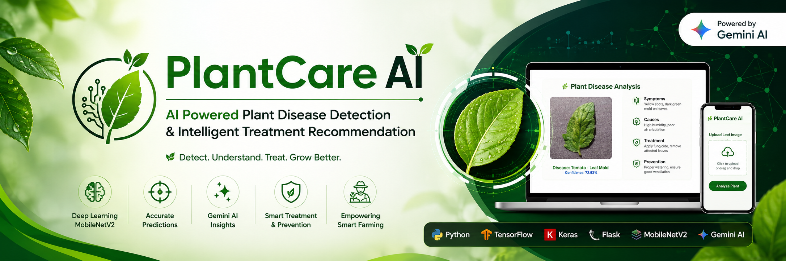
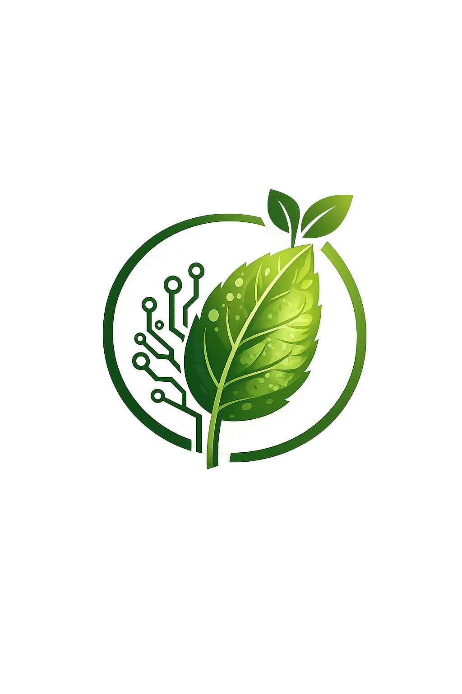
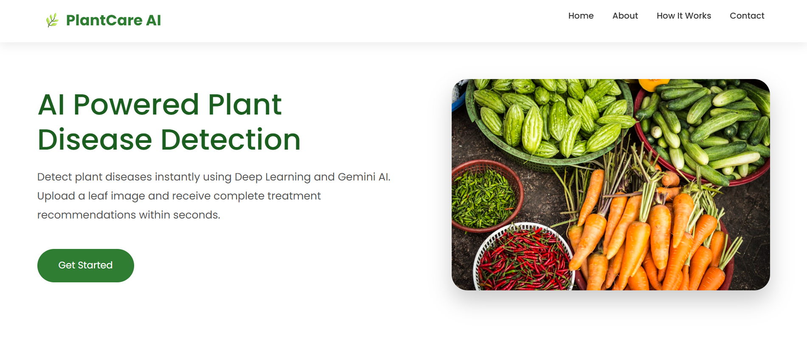
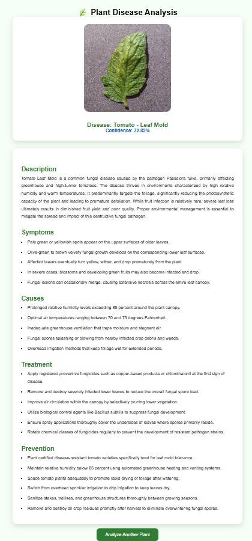
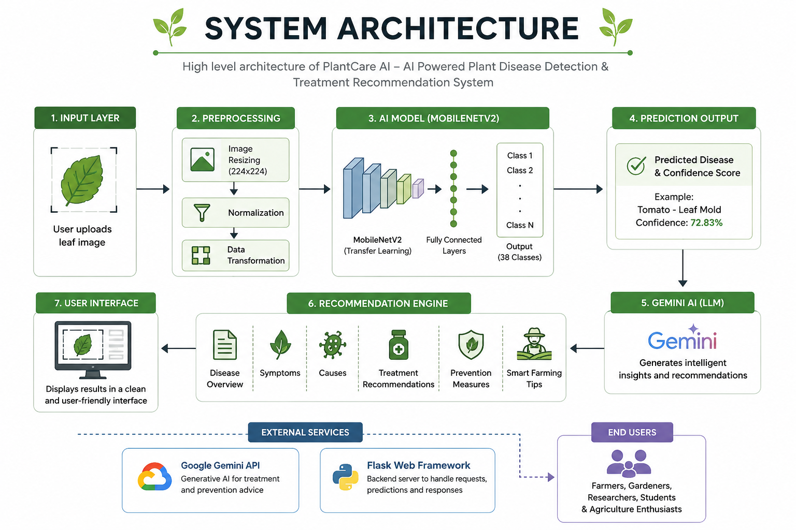

<p align="center">
  
</p>

<p align="center">
  
</p>

<h1 align="center">🌿 PlantCare AI</h1>

<p align="center">
AI-Powered Plant Disease Detection using MobileNetV2 and Google Gemini AI
</p>

<p align="center">


</p>

---

# 📖 Overview

PlantCare AI is an intelligent web application that detects plant diseases from leaf images using a **MobileNetV2 deep learning model** and provides **AI-generated treatment recommendations** powered by **Google Gemini AI**.

The application enables farmers, gardeners, students, and researchers to identify diseases quickly and receive actionable suggestions to improve crop health.

The deep learning model is trained using the **PlantVillage Dataset**, which contains thousands of labeled images across multiple plant species and disease classes.

---

# ✨ Features

- 🌱 Plant disease detection using MobileNetV2
- 🤖 AI-generated treatment recommendations with Google Gemini AI
- 📷 Upload leaf images through an intuitive web interface
- ⚡ Fast disease prediction
- 📊 Confidence score for predictions
- 📚 Disease description and prevention tips
- 💻 Responsive Flask web application
- 🎯 Clean and user-friendly interface

---

# 🎬 Demo

<p align="center">

</p>

---

# 🖼️ Application Screenshots

## Home Page

<p align="center">

</p>

---

## Prediction Result

<p align="center">

</p>

---

# 🏗️ System Architecture

<p align="center">

</p>

---

# 🧠 AI Model

| Component | Details |
|------------|---------|
| Deep Learning Model | MobileNetV2 |
| Framework | TensorFlow / Keras |
| Dataset | PlantVillage Dataset |
| Image Classification | Plant Disease Detection |
| AI Assistant | Google Gemini AI |
| Backend | Flask |
| Frontend | HTML, CSS, JavaScript |

---

# 🛠️ Tech Stack

### Programming Language

- Python

### Deep Learning

- TensorFlow
- Keras
- MobileNetV2

### AI

- Google Gemini AI API

### Backend

- Flask

### Frontend

- HTML
- CSS
- JavaScript

### Dataset

- PlantVillage Dataset

### Version Control

- Git
- GitHub

---

# 📂 Project Structure

```text
PlantCare-AI/
│
├── assets/
│   ├── banner.png
│   ├── logo.png
│   ├── home.png
│   ├── result.png
│   ├── architecture.png
│   └── demo.gif
│
├── database/
│
├── dataset/
│   ├── train/
│   └── val/
│
├── static/
├── templates/
│
├── app.py
├── config.py
├── requirements.txt
├── README.md
└── LICENSE
```

---

# ⚙️ Installation

## Clone the Repository

```bash
git clone https://github.com/shamith-14/PlantCare-AI.git
```

```bash
cd PlantCare-AI
```

---

## Create Virtual Environment

### Windows

```bash
python -m venv venv
venv\Scripts\activate
```

### Linux / macOS

```bash
python3 -m venv venv
source venv/bin/activate
```

---

## Install Dependencies

```bash
pip install -r requirements.txt
```

---

## Configure Environment Variables

Create a `.env` file in the project root and add your Google Gemini API key:

```env
GEMINI_API_KEY=your_api_key_here
```

> **Note:** Never upload your `.env` file to GitHub. Ensure it is listed in `.gitignore`.

---

## Run the Application

```bash
python app.py
```

Then open:

```
http://127.0.0.1:5000
```

---

# 🚀 Future Enhancements

- 📱 Mobile application
- 🌍 Multi-language support
- ☁️ Cloud deployment
- 📈 Disease history tracking
- 📷 Real-time camera detection
- 🌾 Fertilizer recommendation system
- 🌦️ Weather-based disease prediction

---

# 🤝 Contributing

Contributions are welcome!

1. Fork the repository
2. Create a new feature branch
3. Commit your changes
4. Push your branch
5. Open a Pull Request

---

# 📄 License

This project is licensed under the **MIT License**.

---

# 👨‍💻 Author

**Shamith Rai M**

🎓 B.Tech in Artificial Intelligence & Machine Learning  
🏫 Canara Engineering College, Mangalore

**GitHub**

https://github.com/shamith-14

---

<p align="center">

⭐ If you found this project helpful, consider giving it a star!

</p>